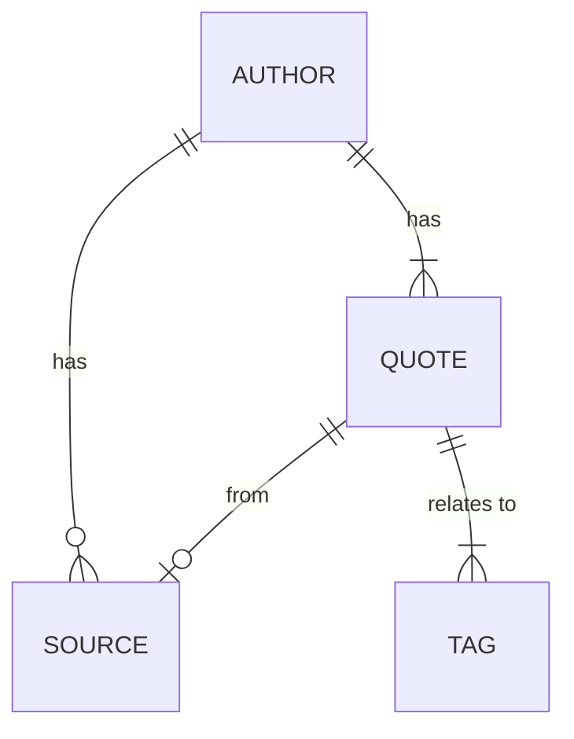

# Overview
This goal of this project is to create a simple app that return a random quote from this [quotes database](https://github.com/ShivaliGoel/Quotes-500K). The web app will be a simple static site hosted on AWS S3 which will invoke a AWS Lambda function that retrieves the quote from data stored in a DynamoDB.

The motivation for this project is to get hands-on experience with AWS services.

# Data model
As stated above we will use DynamoDB to house our data. This [article](https://www.tecracer.com/blog/2021/03/modelling-a-product-catalog-in-dynamodb.html) mentions we should
follow the advice from "[The DynamoDB book](https://www.dynamodbbook.com/)" to create our table:

> * Understand your application
> * Create an entity-relationship diagram (“ERD”)
> * Write out all of your access patterns
> * Model your primary key structure
> * Satisfy additional access patterns with secondary indexes and streams
> 
> — Alex DeBrie, The DynamoDB Book - chapter 7.2

## Understand our application

The use case for the application are as follows:
1. return a random quote (default)
2. the user select a tag and the app returns a random quote given that tag. The tag choice is saved in a cookie.
3. the user select an author and the app returns a random quote given that author. The author choice is saved in a cookie.

## Create and entity-relationship diagram

The raw data from the [quotes database](https://github.com/ShivaliGoel/Quotes-500K) is a CSV file with the following layout:

| Quote | Author,Source | Tags |
| --- | --- | --- |
| To be or not to be, that is the question | William Shakespeare, Hamlet | education, philosophy |
| Trying is the first step to failure | Homer Simpson | life-philosophy |

This leads us to define the following four entities:

##  Write out all of your access patterns

1. Get all Tags
2. Get all Authors
3. Get quote by id
4. List quotes by tag
5. List quotes by author
6. List quites by author and tag

| #	 | Entity | Description | Parameters |
| --- | --- | --- | --- |
| 1 | TAG | Get all | N/A  |
| 2 | AUTHOR | Get all | N/A |
| 3 | QUOTE | Get by id | <qid> |
| 4 | QUOTE | List by tag | <tid> |
| 5 | QUOTE | List by author | <aid> |
| 6 | QUOTE | List by author and tag | <aid>+<tid> |

## Model your primary key structure
We start by modeling the Tags and Authors:

|PK (Partition Key) }| SK (Sort Key) | type | name | tagId | authorId |
| --- | --- | --- | --- | --- | --- |
| TAGS | T#1 | TAG | education | 1  |    |
| TAGS | T#2 | TAG | philosophy | 2  |    |
| TAGS | T#3 | TAG | life-philosophy | 3  |    |
| AUTHORS | A#1 | AUTHOR | William Shakespeare |  |  1  |
| AUTHORS | A#2 | AUTHOR | Homer Simpson |  |  2  |

Next comes the Quotes, here is one transposed row:
| Attribute | Value |
| --- | --- |
| PK | Q#1 |
| SK | METADATA |
| type | QUOTE |
| quote | To be or not to be, that is the question |
| quoteId | 1 |
| author | William Shakespeare |
| source | Hamlet |
    
To list by tag we use a Global Secondary Index (GSI):
| PK |	SK | type | GSI1PK | GSI1SK |
| --- | --- | --- | --- |
| Q#<qid> |	METADATA | QUOTE | T#<tid> | A#<aid>#Q#<qid> |

which allows to query by tag and by tag and author. 

To search by author we use the a new GSI:
| PK |	SK | type | GSI2PK | GSI2SK |
| --- | --- | --- | --- |
| Q#<qid> |	METADATA | QUOTE | A#<aid> | T#<tid>#Q#<qid> |
    
Final result:
|Entity|PK|SK|GSI1PK|GSI1SK|GSI2PK|GSI2SK|
| --- | --- | --- | --- | --- | --- | --- | 
|Tag|TAGS|T#<tid>|||||
|Author|AUTHORS|A#<cid>|||||
|Quote|Q#<qid>|METADATA|T#<tid>|T#<tid>#Q#<qid>|A#<aid>|T#<tid>#Q#<qid>|
    
